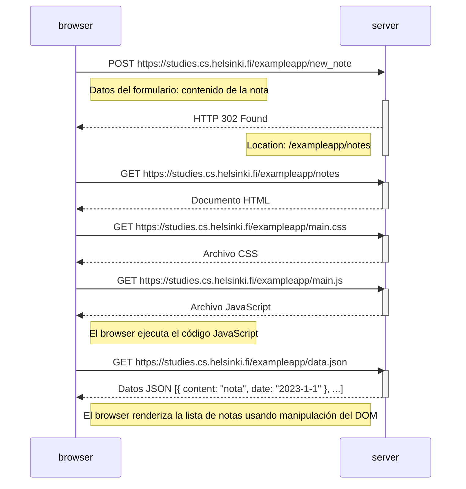

# Ejercicio 0.4: Diagrama de nueva nota

```mermaid
sequenceDiagram
    participant browser
    participant server

    browser->>server: POST https://studies.cs.helsinki.fi/exampleapp/new_note
    Note right of browser: Datos del formulario: contenido de la nota
    activate server
    server-->>browser: HTTP 302 Found
    Note left of server: Location: /exampleapp/notes
    deactivate server

    browser->>server: GET https://studies.cs.helsinki.fi/exampleapp/notes
    activate server
    server-->>browser: Documento HTML
    deactivate server

    browser->>server: GET https://studies.cs.helsinki.fi/exampleapp/main.css
    activate server
    server-->>browser: Archivo CSS
    deactivate server

    browser->>server: GET https://studies.cs.helsinki.fi/exampleapp/main.js
    activate server
    server-->>browser: Archivo JavaScript
    deactivate server

    Note right of browser: El browser ejecuta el código JavaScript

    browser->>server: GET https://studies.cs.helsinki.fi/exampleapp/data.json
    activate server
    server-->>browser: Datos JSON [{ content: "nota", date: "2023-1-1" }, ...]
    deactivate server

    Note right of browser: El browser renderiza la lista de notas usando manipulación del DOM
```
