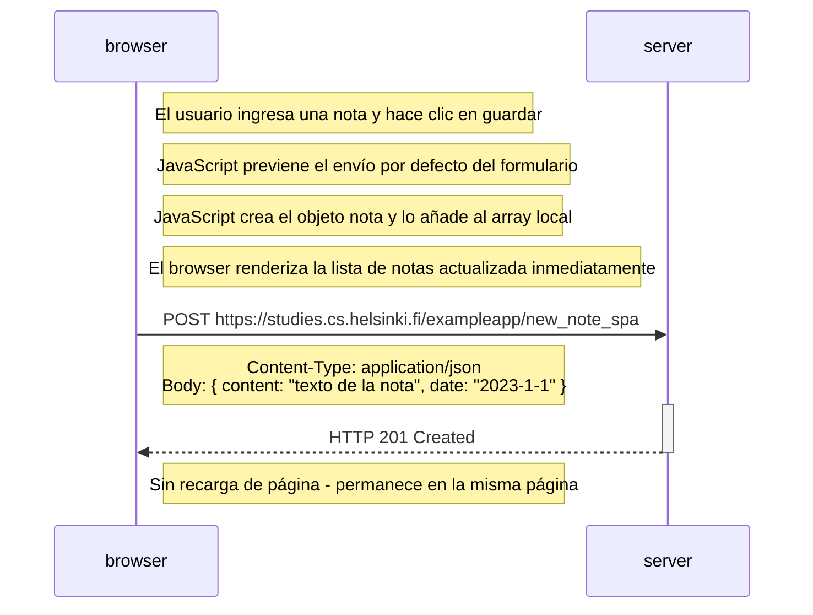

# Ejercicio 0.6: Diagrama de nueva nota en SPA

```mermaid
sequenceDiagram
    participant browser
    participant server

    Note right of browser: El usuario ingresa una nota y hace clic en guardar

    Note right of browser: JavaScript previene el envío por defecto del formulario

    Note right of browser: JavaScript crea el objeto nota y lo añade al array local

    Note right of browser: El browser renderiza la lista de notas actualizada inmediatamente

    browser->>server: POST https://studies.cs.helsinki.fi/exampleapp/new_note_spa
    Note right of browser: Content-Type: application/json<br/>Body: { content: "texto de la nota", date: "2023-1-1" }
    activate server
    server-->>browser: HTTP 201 Created
    deactivate server

    Note right of browser: Sin recarga de página - permanece en la misma página
```
