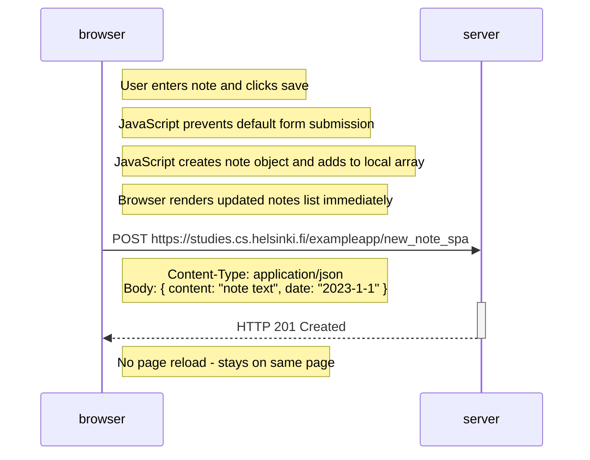

# Exercise 0.6: New Note in SPA Diagram

```mermaid
sequenceDiagram
    participant browser
    participant server

    Note right of browser: User enters note and clicks save

    Note right of browser: JavaScript prevents default form submission

    Note right of browser: JavaScript creates note object and adds to local array

    Note right of browser: Browser renders updated notes list immediately

    browser->>server: POST https://studies.cs.helsinki.fi/exampleapp/new_note_spa
    Note right of browser: Content-Type: application/json<br/>Body: { content: "note text", date: "2023-1-1" }
    activate server
    server-->>browser: HTTP 201 Created
    deactivate server

    Note right of browser: No page reload - stays on same page
```
